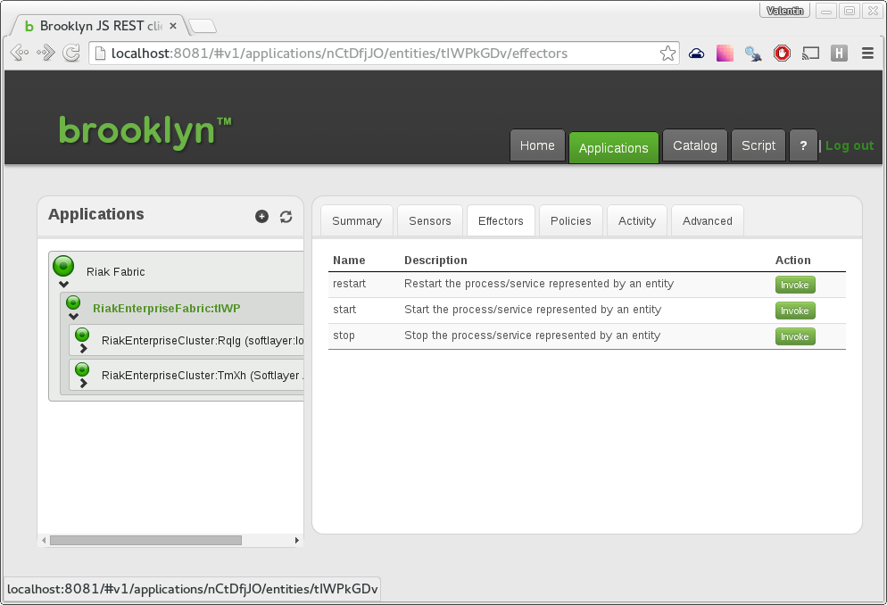
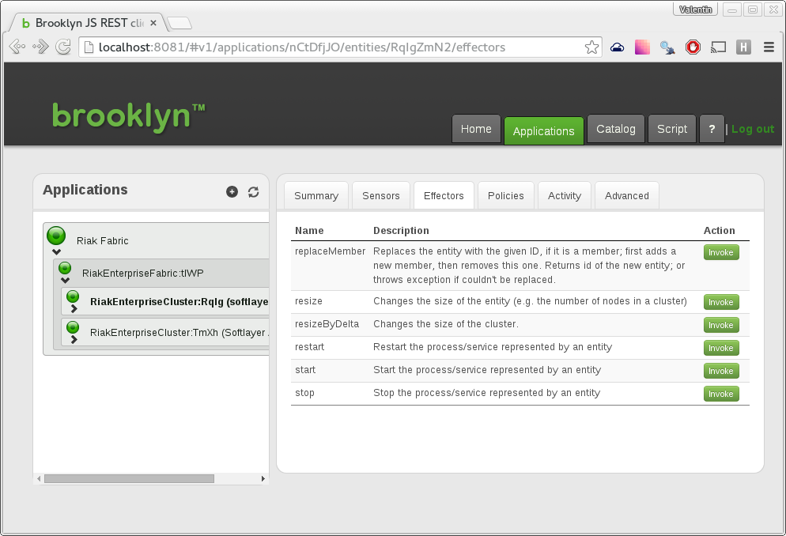
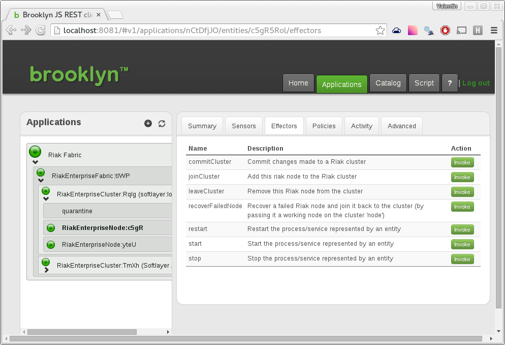
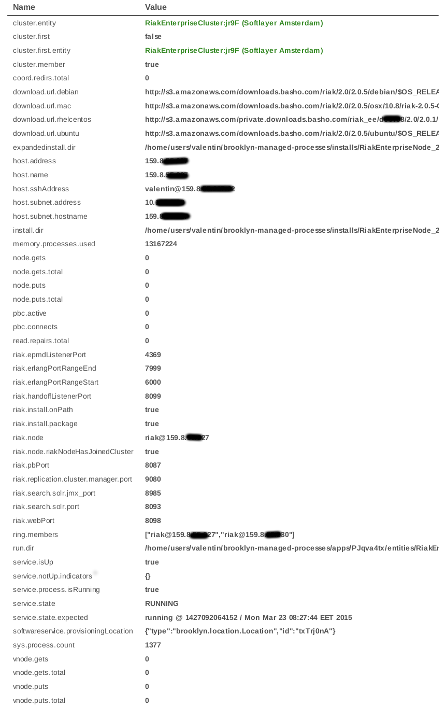

---
---

# AMP-Basho Management Capabilities

AMP-Basho provides automation hooks for many of the common metrics and operations
done on Riak nodes and clusters.  This page describes the detail for accessing this
through the AMP-Basho / Brooklyn console.

Note that everything done here is available through a REST API,
described in the console under **Script -> REST API**. 

## Effectors

*Effectors* in Brooklyn -- and in autonomic computing -- are the operations which can be performed
on individual items.  The Riak blueprints provides different effectors on the nodes,
the clusters, and the *fabric* of multiple clusters.

To access effectors, go to the **Applications** tab in the Brooklyn console (usually at [http://localhost:8081](http://localhost:8081)),
expand the application tree at left and select the entity of interest, and then open the **Effectors** tab on the right.

### RiakEnterpriseFabric

The list of effectors you can invoke:

- **restart**	Restart the process/service represented by an entity
- **start**	Start the process/service represented by an entity
- **stop**	Stop the process/service represented by an entity

---------------------------------------

 

### RiakEnterpriseCluster

The list of effectors you can invoke:

- **replaceMember**	Replaces the entity with the given ID, if it is a member; first adds a new member, then removes this one. Returns id of the new entity; or throws exception if couldn't be replaced.
- **resize**	Changes the size of the entity (e.g. the number of nodes in a cluster)
- **resizeByDelta**	Changes the size of the cluster.
- **restart**	Restart the process/service represented by an entity
- **start**	Start the process/service represented by an entity
- **stop**	Stop the process/service represented by an entity

---------------------------------------

 

### RiakEnterpriseNode

The list of effectors you can invoke:

- **commitCluster**	Commit changes made to a Riak cluster	Invoke
- **joinCluster**	Add this riak node to the Riak cluster	Invoke
- **leaveCluster**	Remove this Riak node from the cluster	Invoke
- **recoverFailedNode**	Recover a failed Riak node and join it back to the cluster (by passing it a working node on the cluster 'node')	Invoke
- **restart**	Restart the process/service represented by an entity	Invoke
- **start**	Start the process/service represented by an entity	Invoke
- **stop**	Stop the process/service represented by an entity

---------------------------------------

 

## Sensors

**Sensors** are the means by which Apache Brooklyn publishes information about activity in the system.
This includes URL's, health, and performance, and these feeds can be linked to dependency injection
in the blueprints or to automated management policies, e.g. for resilience and elasticity. 

