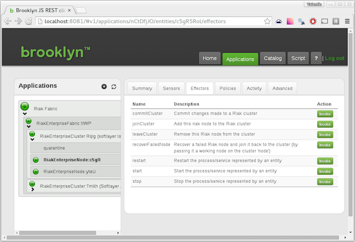

---
---

amp-basho
===

The **AMP-Basho** software will automatically deploy and manage 
Basho [Riak](http://docs.basho.com/riak/latest/) 
and [Riak Enterprise](http://docs.basho.com/riak/latest/ops/mdc/comparison/) 
clusters in a wide range of environments.
This uses [Apache Brooklyn](http://brooklyn.io)'s easy-to-use YAML blueprinting approach,
combined with [Cloudsoft](http://cloudsoftcorp.com)'s enterprise-supported 
Application Management Platform (AMP).

Getting started is a breeze, and beyond that there is a raft of support 
for autonomic management, replication, resilience, scaling, and dependency injection.
These advanced capabilities are described further below,
after the **Quick Start** which runs a simple multi-node blueprint.


Quick Start
---

Once the distro is unpacked, run:

    ./start.sh launch 

To launch the simplest Riak Enterprise three-node cluster blueprint, 
open the AMP-Basho / Brooklyn console (usually on [http://localhost:8081](http://localhost:8081)) and
paste the following YAML in to the **Add Application -> YAML** dialog:

```
name: Simplest Riak Cluster

location:
  jclouds:aws-ec2:
    region: us-east-1
    osFamily: centos
    osVersionRegex: 7\..*
    identity: YOUR_IDENTITY
    credential: YOUR_CREDENTIAL
    
services:
- type: io.cloudsoft.basho.RiakEnterpriseCluster
  initialSize: 3
  download.url.rhelcentos: http://YOUR_DOWNLOAD_URL.FOR_EXAMPLE.s3.amazonaws.com/private.downloads.basho.com/riak_ee/YOUR_CODE/2.0/2.0.5/rhel/7/riak-ee-2.0.5-1.el7.centos.x86_64.rpm
```

Replace `YOUR_DOWNLOAD_URL` with the URL supplied by Basho, in this case for CentOS 7,
and replace `YOUR_IDENTITY` and `YOUR_CREDENTIAL` with the appropriate tokens for your environment.
Other clouds -- including OpenStack and SoftLayer -- are supported,
or you can provide a list of IP addresses to use machines which already exist.
For more information on configuring locations,
see the [Locations](https://brooklyn.io/v/latest/ops/locations/index.html)
page in the [Brooklyn Users Guide](https://brooklyn.io/v/latest/index.html).

**Don't have a Riak Enterprise download?**  [Open-source Riak](http://docs.basho.com/riak/latest/) 
is supported by [Apache Brooklyn Riak blueprints](https://github.com/apache/incubator-brooklyn/blob/master/software/nosql/src/main/resources/brooklyn/entity/nosql/riak/riak.md). 
These blueprints can be deployed in AMP-Basho.

**Prefer a different OS?**  Try `osFamily: ubuntu` and `download.url.ubuntu: YOUR_URL`, or the same for `debian`.
See the [Riak node config keys reference](docs/RiakNode-config.md) for more information. 

You can then follow the progress of the deployment in the AMP-Basho console by clicking on the
**Applications** tab and expanding the application nodes.  Once the system is live,
the **Sensors** tab will show stats from each node and the URL for the Riak console.
The **Effectors** tab gives you
runtime control of individual nodes and of the cluster, including the capability to 
resize a cluster (adding and removing nodes according to the 
[Riak best practice instructions](http://docs.basho.com/riak/latest/ops/running/nodes/adding-removing/))
and recover failed nodes.  



More information on managing your Riak cluster with AMP-Basho is 
[here](docs/managing-riak.md).
For more information on using Apache Brooklyn,
on which AMP-Basho is based, visit [http://brooklyn.io](http://brooklyn.io).


Runtime Options
---

Once you've done an initial test and torn it down, 
there are a few runtime options you'll probably want to use.
Stop AMP-Basho (there is a link to stop in the `?` menu;
unless you've set up persistence, we recommend clicking `Stop all applications`,
otherwise VM's you've created will be left running!),
set up the following as you would like, and relaunch:   

* **Keep it running**:  launch with `nohup` and/or install as a service in `/etc/rc.local/`
  to have AMP-Bash restarted automatically on a server restart
  
* **Configure secure login**:  by default, AMP-Basho, like Brooklyn, runs with localhost access only;
  to set up a user and password for external access and set up `https` support,
  [follow these instructions](https://brooklyn.io/v/latest/ops/brooklyn_properties.html#authentication).

* **Store cloud credentials**: for commonly used cloud endpoints,
  it is often convenient to set up "named locations" in your `brooklyn.properties` file
  [as described here](https://brooklyn.io/v/latest/ops/locations/index.html#inheritance-and-named-locations).

* **Turn on persistence**: AMP-Basho, like Brooklyn, can be configured to persist data of deployments
  from one run to the next; to turn this on, pass `--persist auto` on the command line,
  and for more complex persistence and HA strategies [consult this page](https://brooklyn.io/v/latest/ops/persistence/index.html)


More Examples
---

After your AMP-Basho install is configured, you'll likely want to 
deploy the right topology for your Riak installations and other software.
These examples will help you on your way:

* **[Web App with Riak Cluster](docs/example-with-webapp.md)** 
  shows how to stand up a cluster alongside other components
  
* **[Riak Multi-Datacenter and Web App with Policy](docs/example-behemoth.md)**
  shows how to set up an MDC configuration in several clouds and fixed IP machines,
  together with a web cluster with an attached scaling policy


Next Steps
---

For more information on managing Basho Riak from AMP-Basho, see these mini-guides:

* **Configuration**: AMP-Basho supports many of the [configuration options](http://docs.basho.com/riak/latest/ops/building/configuration/)
  exposed by Riak, including specifying the `clusterName` or setting an `advanced.config` file to be used.
  There are full references for the Brooklyn config keys
  available on [the Riak Node](docs/RiakNode-config.md) and on the [Riak Cluster](docs/RiakCluster-config.md).

* **Operations**: Many of the Riak management operations and monitoring ([see Riak doc](http://docs.basho.com/riak/latest/)) 
  are supported by effectors and sensors in AMP-Basho.
  For more information, see [Managing Riak from AMP-Basho](docs/managing-riak.md).

To learn more about working with Apache Brooklyn blueprints,
the [Brooklyn Blueprint Tour](https://brooklyn.io/learnmore/blueprint-tour.html) 
is a good starting point.


License
---

AMP-Basho is built on [Cloudsoft AMP](http://www.cloudsoftcorp.com) and [Apache Brooklyn](http://brooklyn.io)
and is copyright &copy; 2015 by Cloudsoft Corporation and Basho.

License for AMP-Basho is hereby granted for non-commercial and evaluation purposes 
under the terms of [the Cloudsoft EULA](LICENSE.txt).
For a commercial license please contact your Basho representative. 

The open-source Riak components used here are included in core [Apache Brooklyn](http://brooklyn.io).
Blueprints which do not depend on Riak Enterprise capabilities or download links
can be used for any purpose under the terms of the that license (Apache Software License 2.0)
by following the instructions for [Apache Brooklyn](http://brooklyn.io). 

